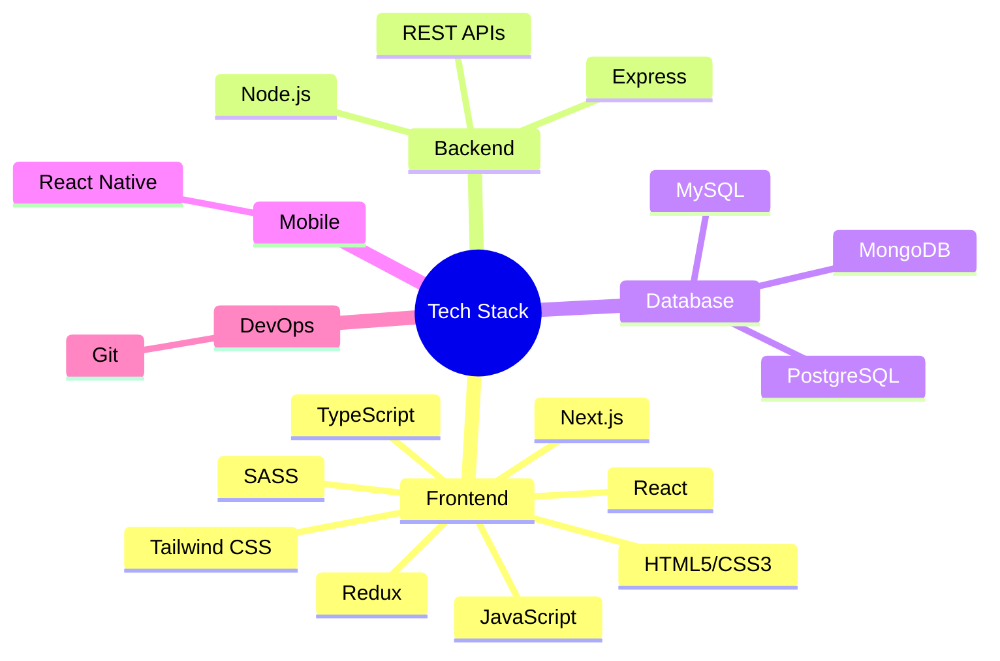

# 🌌 Welcome to the Digital Universe of Emad Ahmed

<div align="center">
  
  
  [](https://open.spotify.com/user/YOUR_SPOTIFY_USERNAME)
</div>


## 🚀 About Me

> "Code is poetry written for machines, but read by humans."

Greetings, fellow digital explorer! I'm a passionate full stack developer from Pakistan who transforms ideas into elegant, functional digital experiences. My journey in the world of programming began with curiosity and evolved into a lifelong adventure of creation and problem-solving.

When the code compiles successfully and all tests pass, you might find me exploring new technologies, contributing to open-source projects, or mentoring aspiring developers. Let's build something amazing together!

## 🌈 The Tech Cosmos I Navigate

<div align="center">
  


</div>

## ⚙️ My Developer DNA

```javascript
const developer = {
  name: "Emad Ahmed",
  location: "Pakistan",
  role: "Full Stack Developer",
  workingOn: "Building resilient and elegant web applications",
  learning: ["WebAssembly", "GraphQL", "System Architecture"],
  askMeAbout: ["web dev", "tech", "app dev", "photography"],
  dailyFuel: {
    languages: ["JavaScript", "TypeScript", "Python"],
    frameworks: ["React", "Next.js", "Express"],
    databases: ["MongoDB", "PostgreSQL", "MySQL"],
    tools: ["VSCode", "Docker", "Postman", "Figma"],
    architectures: ["SSR", "SPA", "Microservices"],
  },
  funFact: "There are two ways to write error-free programs; only the third one works."
};
```

## 🌠 Cosmic Stats

<div align="center">
  
</div>

<div align="center">
  
  
</div>

## 💻 Featured Creations

<div align="center">
  <a href="#">
    
  </a>
  <a href="#">
    
  </a>
</div>

## 🛠️ Technologies & Tools

<p align="center">
  
  
  
  
  
  
  
  
  
  
  
  
  
  
  
  
  
</p>

## 🌌 Coding Nebula

<div align="center">
  
</div>

## 🔭 Weekly Development Breakdown

<!--START_SECTION:waka-->
```text
JavaScript   ██████████████▓░░░░░░  65.52 % 
TypeScript   ████▓░░░░░░░░░░░░░░░░  18.25 % 
CSS          ██▒░░░░░░░░░░░░░░░░░░   9.10 % 
JSON         █▒░░░░░░░░░░░░░░░░░░░   5.20 % 
Other        ▒░░░░░░░░░░░░░░░░░░░░   1.93 % 
```
<!--END_SECTION:waka-->

## 📱 Let's Connect and Create

<div align="center">
  <a href="https://www.linkedin.com/in/emad-ahmed-7b1024314/">
    
  </a>
  <a href="mailto:emadahmed7427@gmail.com">
    
  </a>
</div>

<div align="center">
  <br>
  <p>🌟 <i>Thanks for visiting my digital space! Don't forget to <a href="https://github.com/yourfriend">follow</a> for updates on my latest projects!</i> 🌟</p>
</div>

<div align="center">
  
</div>
